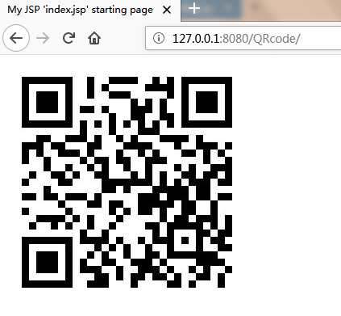

# zxing_demo

>基于zxing的二维码demo   
>zxing项目地址:[https://github.com/zxing/zxing](https://github.com/zxing/zxing)
### 本地生产二维码图片

```
public static void main(String[] args) {
    String content="https://fedemo.top";
  String logUri="D:\\favicon.ico";
  String outFileUri="D:\\img.jpg";
  int[]  size=new int[]{430,430};
  String format = "jpg";  
  try {
      new QRCodeFactory().CreatQrImage(content, format, outFileUri, logUri,size);
  } catch (IOException e) {
      e.printStackTrace();
  } catch (WriterException e) {
      e.printStackTrace();
  }   
}
```


### 将二维码图片写入流\

```
/**
* 获得二维码
* @param mapping
* @param form
* @param request
* @param response
* @throws Exception
*/
public void img(final ActionMapping mapping,
    final ActionForm form, final HttpServletRequest request,
    final HttpServletResponse response) throws Exception {
 String content="https://fedemo.top";
 int[]  size=new int[]{300,300};
 String format = "jpg";
 BufferedImage img=null;
 try {
   img=new QRCodeFactory().CreatImg(content, format, size);
 } catch (WriterException e) {
    e.printStackTrace();
 }
 ImageIO.write(img , "jpg", response.getOutputStream());
}
```
>img图片

```
    
```


